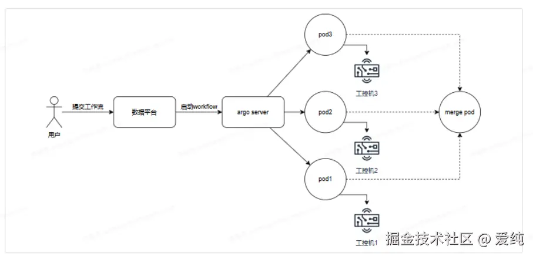

# script-runner

## 1、描述
智驾云数据平台采用k8s argo 调度系统起工作流任务的。对于平台管理者来说，只需要在workflow 模板中配置容器镜像、容器配置（cpu、gpu、内存）、运行脚本即可。

如下图就是一个典型的工控机回灌评测工作流，根据预先搭好的工作流模板，用户在数据平台上提交任务、数据平台调用argo server起pod，pod 里跑的脚本调用工控机的回灌任务，最后pod 将收集工控机回灌结果做评测。

由此可见，pod 跑的脚本设计是整个工作流的核心，scriptRunner 即脚本框架

## 2、方案设计

## 3、scriptRunner的优势

原有的shell框架可以解决大部分工作流任务，但仍有缺点

● shell 脚本不易调试，依赖较多对环境要求高

● shell 编程语法较为生涩，遇到复杂逻辑或者复杂场景支持度不高

● 公共库支持度不够，例如拓展flowcli，需要重新发版和打包到工作流，这使得增加和数据平台的交互成本很高。

scriptRunner 框架采用python开发，每个脚本将被命名为一种runner，注册到RunnerMgr 中。原有的shell 框架作为套壳框架，处理逻辑由scriptRunner 负责。

runner 有以下工厂方法

● init

● getID

● process

● gitFetch 基类实现，负责下载第三方git仓库

scriptRunner 可以有效解决原shell框架问题，使得算子开发更加高效和规范！
